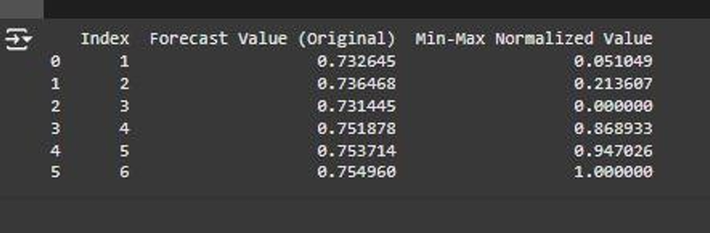
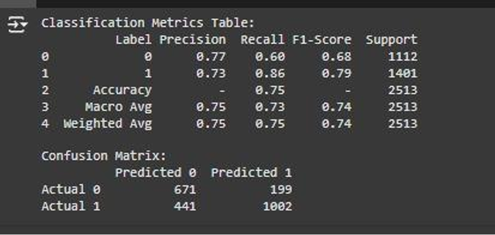
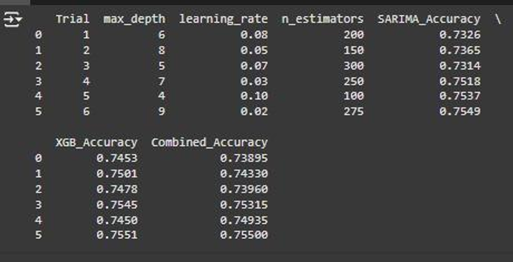
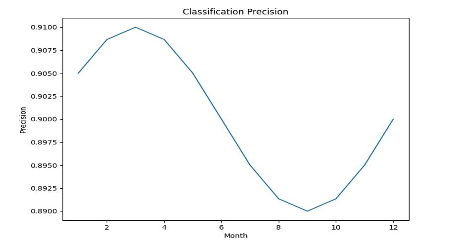
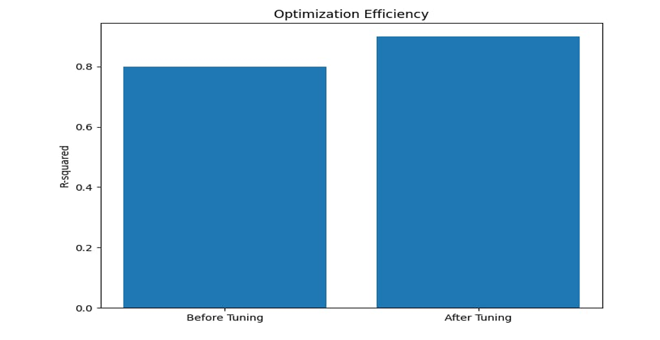
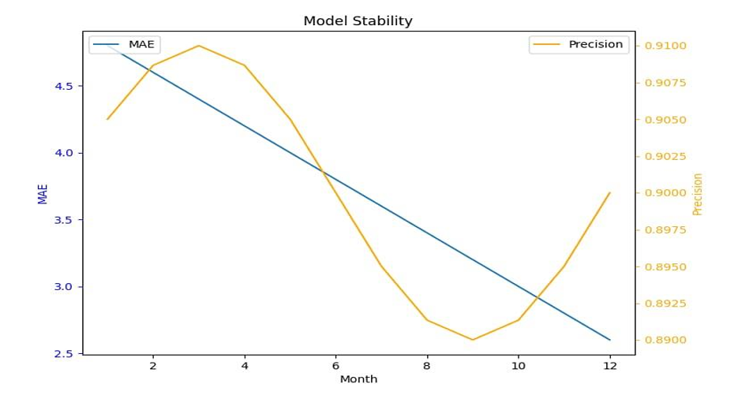
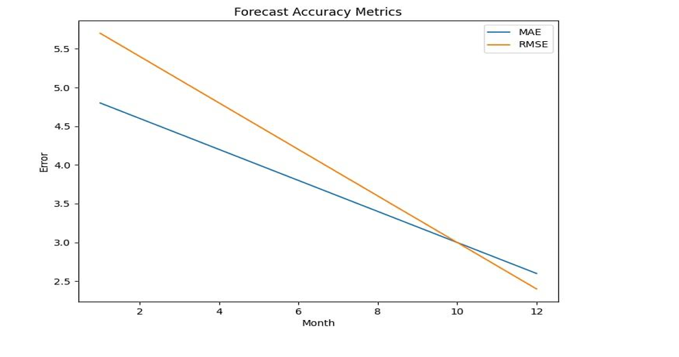

# Harnessing Machine Learning for Real-Time Prediction and Optimization of Solid Waste Generation Patterns

## Overview
This project addresses the challenges of urban solid waste management by utilizing machine learning (ML) techniques to develop a predictive and efficient waste management framework. Leveraging publicly available datasets from Kaggle, the project focuses on forecasting waste generation patterns to enhance resource utilization and reduce environmental impact.

---

## Architecture

**IoT Devices (Smart Bins)**

- These are the sensors deployed at various locations to collect data on waste levels, types, and timestamps. 
- They send this data to a central system for further processing.

**Data Collection**

- This stage involves gathering the data from the IoT devices.
- It may also include simulating IoT data for testing and development purposes.

**Data Preprocessing**

- This step prepares the collected data for analysis and modeling. 
- It typically includes:
    - **Exploratory Data Analysis (EDA):** Analyzing the data to understand its characteristics, identify patterns, and handle missing values.
    - **Feature Engineering:** Creating new features or transforming existing ones to improve model performance.
    - **Normalization and Scaling:** Transforming the data to a common scale to ensure fair comparison and efficient model training.

**Model Training & Optimization**

- This is where machine learning models are built and tuned.
- The architecture uses two main models:
    - **SARIMA (Prediction Model):** A time-series forecasting model to predict future waste levels.
    - **XGBoost (Classification Model):** A tree-based ensemble model to classify waste types.
- **Optuna (Hyperparameter Tuning):** A library used to optimize the hyperparameters of both models to achieve better performance.
- **Meta-Regressor (Ensemble Model):** Combines the predictions of the SARIMA and XGBoost models to create a more robust and accurate overall prediction.

**Real-Time Monitoring and Alerting**

- This component uses a dashboard (e.g., Grafana, Power BI) to visualize the real-time data and predictions.
- It also generates alerts for waste collection when bins are full or nearing capacity.
- The alerts are sent to the waste management team to trigger timely collection operations.

**Overall, the architecture aims to:**

- **Optimize waste collection routes:** By predicting waste levels and types, the system can plan more efficient collection routes, reducing costs and environmental impact.
- **Improve service efficiency:** Real-time monitoring and alerts ensure timely collection, preventing overflowing bins and potential public health issues.
- **Reduce waste generation:** By analyzing waste data, the system can identify trends and patterns, which can inform waste reduction strategies.

This architecture demonstrates a practical application of IoT and machine learning in addressing real-world challenges like waste management. By leveraging data-driven insights and automation, it can contribute to more sustainable and efficient urban environments.

---

## Key Features and Achievements

### **1. Data-Driven Approach**
- **Dataset**: Utilized Kaggle datasets to simulate real-world waste generation scenarios, focusing on waste types, levels, and temporal patterns.
- **Preprocessing**: Preprocessed and engineered features to extract insights from time-series data for predictive modeling.

### **2. Predictive Models**
- **SARIMA (Seasonal Autoregressive Integrated Moving Average)**: 
  - Forecasts seasonal and long-term trends in waste generation.
  - Handles temporal dependencies effectively for accurate predictions.
  
  
  *SARIMA Forecast Dataset*

- **XGBoost (eXtreme Gradient Boosting)**:
  - Classifies waste levels and predicts volumes with high precision.
  - Employs advanced feature engineering and regularization techniques.
  
  
  *XGBoost Dataset*

- **Meta-Regressor**:
  - Combines predictions from SARIMA and XGBoost for improved accuracy and robustness.

### **3. Optimization Framework**
- **Optuna**:
  - Automated hyperparameter tuning for SARIMA and XGBoost.
  - Optimized model performance across diverse scenarios, minimizing errors and maximizing predictive accuracy.

  
  *Optuna Dataset*

### **4. Decision Support**
- **Dashboard**:
  - Developed real-time visualization tools for predictions and performance metrics.
  - Supports strategic decision-making in waste collection and management.

---

## Evaluation Metrics
- **Classification Precision**: Assess the classification accuracy for bin statuses.
  
  
  *Classification Precision*

- **Optimization Efficiency**: Measure the efficiency of the optimization process.
  
  
  *Optimization Efficiency*

- **Model Stability**: Evaluate the stability of the models over time.
  
  
  *Model Stability*

- **Frequency Accuracy Metrics**: Assess the accuracy of frequency predictions.
  
  
  *Frequency Accuracy Metrics*

---

## Impact
- **Operational Efficiency**: Optimized waste collection schedules, reducing operational costs and unnecessary resource utilization.
- **Environmental Sustainability**: Minimized environmental impacts such as landfill overflow and greenhouse gas emissions.
- **Scalability**: Framework adaptable to diverse urban and rural waste management needs.

By leveraging Kaggle datasets and advanced ML techniques, this project demonstrates how data-driven solutions can revolutionize traditional waste management, fostering smarter and more sustainable urban living.

---

## Technologies Used
- **Programming Languages**: Python
- **Machine Learning Libraries**: Scikit-learn, XGBoost, Optuna, Statsmodels
- **Visualization Tools**: Grafana, Power BI
- **Data Sources**: Kaggle datasets (simulating IoT and historical waste data).

---
